# Interactive Car Sales Dashboard - Design Document

## 1. Overview

The Interactive Car Sales Dashboard is a modern, visually stunning React application that provides comprehensive insights into the 2025 automotive dataset. The dashboard features a premium dark-themed interface with glass morphism effects, smooth animations, and responsive design that works across all device sizes. It visualizes key performance indicators, interactive charts, and detailed data tables to help users explore and understand the car market trends.

### Key Features
- Modern dark theme with automotive-inspired gradients
- Glass morphism design elements with subtle shadows
- Interactive and animated data visualizations
- Responsive layout for all screen sizes
- Real-time metrics display
- Cross-filtering between visualizations
- Advanced data table with virtual scrolling

## 2. Technology Stack & Dependencies

### Frontend Framework
- **React** - Core UI library for building the dashboard components

### Visualization Libraries
- **Recharts** - Primary charting library for responsive and animated visualizations
- **D3.js** - Custom visualization components where Recharts limitations exist
- **Plotly** - Advanced 3D plotting capabilities for specialized visualizations

### Data Processing
- **Papaparse** - Robust CSV parsing for the car dataset
- **Lodash** - Data aggregation, grouping, and manipulation utilities

### Styling & UI
- **Tailwind CSS** - Utility-first CSS framework for styling components
- **Custom CSS Animations** - Micro-interactions and transitions
- **CSS Variables** - Theme management for consistent color palette

### Performance Optimization
- **React.memo** - Component memoization for expensive renders
- **useMemo/useCallback** - Memoization of computations and callbacks
- **React Virtual** - Virtual scrolling for large data tables
- **Debounce** - Filter update optimizations

### State Management
- **React Context API** - Application state management
- **React Hooks** - Component state and side effects

### Development & Build Tools
- **Vite** - Fast development server and build tool
- **ESLint** - Code quality and consistency
- **Prettier** - Code formatting

## 3. Component Architecture

### Component Hierarchy

```mermaid
graph TD
    A[App] --> B[Header]
    A --> C[KPIsSection]
    A --> D[ChartsSection]
    A --> E[DataTableSection]
    A --> F[FilterControls]
    
    B --> B1[Title]
    B --> B2[MetricsTicker]
    B --> B3[AnimatedBackground]
    
    C --> C1[MetricCard]
    C --> C2[PriceRangeCard]
    C --> C3[HighlightCard]
    
    D --> D1[PriceDistributionChart]
    D --> D2[BrandPerformanceChart]
    D --> D3[MarketShareChart]
    D --> D4[YearPriceTrendChart]
    D --> D5[FeatureAnalysisChart]
    
    E --> E1[DataTable]
    E --> E2[TableControls]
    
    F --> F1[BrandFilter]
    F --> F2[PriceRangeSlider]
    F --> F3[YearRangeSelector]
    F --> F4[FuelTypeToggle]
    F --> F5[BodyTypeSelector]
```


### Core Components

#### Header Component
- Title display: "2025 Automotive Intelligence Dashboard"
- Real-time metrics ticker showing total cars, average price, and most popular brand
- Animated background with moving gradients or particles
- Global filter controls with smooth animations

#### KPIsSection Component
- Metric cards with counter animations for total vehicles count
- Average price display with currency formatting
- Price range visualization with min/max values
- Most expensive car highlight with placeholder image

#### ChartsSection Component
Contains multiple interactive chart components:
- **PriceDistributionChart**: Histogram with animated bars, tooltips, and brushable selection
- **BrandPerformanceChart**: Scatter plot with brand vs. average price, bubble size for car count
- **MarketShareChart**: Donut chart with brand distribution and hover effects
- **YearPriceTrendChart**: Multi-line chart showing price trends by brand
- **FeatureAnalysisChart**: Radar chart comparing brands across multiple dimensions

#### DataTableSection Component
- Advanced filtering and sorting capabilities
- Virtual scrolling implementation for performance with large datasets
- Row highlighting on hover
- Quick action buttons for view details, compare, and favorite
- Export functionality for data (CSV, PNG, PDF)

#### FilterControls Component
- Multi-select brand filter with search functionality
- Price range slider with live updates
- Year range selector
- Fuel type toggles
- Body type selection

### Component Communication
- Context API for global state management
- Event callbacks for filter updates
- Cross-component filtering through shared state
- Data flow from parent to child components via props

## 4. Props/State Management

### Global State Structure
```javascript
{
  // Filter state
  filters: {
    brands: string[],
    priceRange: [number, number],
    yearRange: [number, number],
    fuelTypes: string[],
    bodyTypes: string[]
  },
  
  // Data state
  rawData: CarData[],
  filteredData: CarData[],
  
  // UI state
  loading: boolean,
  selectedBrand: string | null,
  selectedPriceRange: [number, number] | null
}
```

### Component Props
- All components receive filtered data through context
- Chart components receive specific data slices based on their visualization needs
- Filter components manage their own local state but sync with global state
- KPI components derive values from filtered data

### State Management Patterns
- React Context API for global application state
- useState and useReducer for component-level state
- useEffect for data processing and side effects
- Custom hooks for reusable state logic

## 5. Routing & Navigation

As a single-page dashboard application, routing is minimal but includes:
- **Main Dashboard** (/) - Primary dashboard view with all components
- **Detailed View** (/details/:carId) - Detailed car information view
- **Comparison View** (/compare) - Side-by-side car comparison
- **Export View** (/export) - Data export options and settings

Navigation is handled through:
- Header navigation elements
- DataTable action buttons
- Chart interaction drill-downs
- Contextual links in KPI sections

## 6. Styling Strategy

### Design System
- **Color Palette**:
  - Primary: Deep navy (#0f172a) to dark blue (#1e293b)
  - Secondary: Metallic silver (#64748b) to light gray (#cbd5e1)
  - Accent: Electric blue (#3b82f6) and orange (#f97316)
  - Success: Emerald (#10b981)
  - Warning: Amber (#f59e0b)
  - Error: Red (#ef4444)

### CSS Architecture
- **Tailwind CSS** for utility classes and responsive design
- **Custom CSS Variables** for theme management
- **Component-scoped CSS modules** for encapsulation
- **CSS-in-JS** for dynamic styling based on state

### Responsive Design
- Mobile-first approach with breakpoints:
  - sm: 640px
  - md: 768px
  - lg: 1024px
  - xl: 1280px
  - 2xl: 1536px

Layout adjustments:
- Desktop (1200px+): 4-column grid layout
- Tablet (768px-1199px): 2-column grid with stacked charts
- Mobile (320px-767px): Single column with touch-friendly controls

### Animation System
- **Page Load**: Stagger animation for components (100ms delays)
- **Chart Transitions**: 300-500ms ease-in-out
- **Hover Effects**: 150ms transform and color changes
- **Filter Updates**: 200ms debounce with smooth data transitions
- **Loading States**: Skeleton animations and spinners

## 7. State Management

### Application State
The dashboard uses React Context API for global state management with the following key slices:

1. **Filter State**: Manages all active filters (brands, price range, years, fuel types, body types)
2. **Data State**: Contains raw and filtered car dataset
3. **UI State**: Loading states, selected items, modal visibility
4. **Chart State**: Currently selected chart elements, drill-down paths

### Data Flow
1. Raw data is loaded and parsed from CSV
2. Data is processed and cached for performance
3. Filters are applied to generate filtered dataset
4. Components subscribe to relevant state slices
5. State changes trigger re-renders of affected components

### Performance Considerations
- Memoization of expensive computations
- Virtualized lists for large data tables
- Debounced filter updates
- Lazy loading of non-critical components
- Selective rendering based on viewport

## 8. API Integration Layer

### Data Loading
- CSV file parsing using Papaparse
- Data validation and cleaning
- Initial data processing and aggregation
- Caching mechanism for improved performance

### Data Processing Pipeline
1. **Data Ingestion**: Load and parse CSV file
2. **Data Cleaning**: Handle missing values, normalize formats
3. **Data Transformation**: Convert strings to appropriate data types
4. **Data Aggregation**: Pre-compute values for charts and KPIs
5. **Data Caching**: Store processed data for performance

### Mock Data Structure
```typescript
interface CarData {
  company: string;
  modelName: string;
  engine: string;
  ccBattery: string;
  horsePower: string;
  totalSpeed: string;
  performance: string;
  price: string;
  fuelType: string;
  seats: string;
  torque: string;
}
```

## 9. Testing Strategy

### Unit Testing
- **Jest** as the testing framework
- **React Testing Library** for component testing
- Test coverage for:
  - Data processing functions
  - Filter logic
  - Component rendering
  - State management

### Component Testing
- Test individual components in isolation
- Verify props handling and state changes
- Test user interactions and event handling
- Validate accessibility features

### Integration Testing
- Test data flow between components
- Verify filter propagation across the application
- Test cross-chart filtering functionality
- Validate export functionality

### Visual Testing
- **Storybook** for component development and documentation
- Visual regression testing for UI components
- Cross-browser compatibility testing

### Performance Testing
- Load testing with large datasets
- Rendering performance benchmarks
- Memory usage monitoring
- Filter update responsiveness

## 10. Data Models

### Car Data Model
Based on the provided CSV structure, the dashboard will work with the following data model:

| Field | Description | Data Type | Example |
|-------|-------------|-----------|---------|
| Company Names | Car manufacturer | String | "FERRARI" |
| Cars Names | Model name | String | "SF90 STRADALE" |
| Engines | Engine type | String | "V8" |
| CC/Battery Capacity | Engine size or battery capacity | String | "3990 cc" |
| HorsePower | Power output | String | "963 hp" |
| Total Speed | Maximum speed | String | "340 km/h" |
| Performance | 0-100 km/h acceleration | String | "2.5 sec" |
| Cars Prices | Price range | String | "$1,100,000" |
| Fuel Types | Fuel type | String | "plug in hyrbrid" |
| Seats | Number of seats | String | "2" |
| Torque | Torque output | String | "800 Nm" |

### Derived Data Models
For visualization purposes, the raw data will be transformed into:

1. **Brand Performance Data**:
   - Brand name
   - Average price
   - Car count
   - Market segment

2. **Price Distribution Data**:
   - Price ranges
   - Count of vehicles in each range
   - Percentage distribution

3. **Year vs Price Data**:
   - Year
   - Brand
   - Average price

4. **Feature Analysis Data**:
   - Brand
   - Performance metrics
   - Feature scores

## 11. Business Logic Layer

### Data Processing Logic
- **Price Parsing**: Convert price strings to numeric values for calculations
- **Performance Metrics**: Parse acceleration, speed, and other performance data
- **Aggregation Functions**: Group data by brand, fuel type, year for visualizations
- **Filtering Logic**: Apply multiple filters simultaneously with efficient algorithms

### Visualization Logic
- **Chart Data Transformation**: Convert raw data to chart-specific formats
- **Cross-filtering**: Update all visualizations when a filter changes
- **Drill-down Capabilities**: Navigate from aggregated to detailed data
- **Real-time Updates**: Smooth transitions when data changes

### KPI Calculations
- **Total Vehicles**: Count of all cars in filtered dataset
- **Average Price**: Mean price of all cars in filtered dataset
- **Price Range**: Min and max prices with visual indicators
- **Most Expensive Car**: Find and highlight the highest-priced vehicle

## 12. Middleware & Interceptors

### Data Processing Middleware
- **CSV Parser Middleware**: Handle CSV parsing with Papaparse
- **Data Validation Middleware**: Validate and clean data before processing
- **Format Normalization Middleware**: Standardize data formats across different sources
- **Caching Middleware**: Cache processed data to avoid recomputation

### UI Middleware
- **Animation Middleware**: Manage complex animations and transitions
- **Loading State Middleware**: Handle loading skeletons and progress indicators
- **Notification Middleware**: Manage toast notifications and user feedback
- **Export Middleware**: Handle data export in various formats (CSV, PNG, PDF)

## 13. Security Considerations

### Client-Side Security
- **Input Validation**: Validate all user inputs and filter selections
- **Data Sanitization**: Sanitize data before rendering to prevent XSS
- **Error Handling**: Graceful error handling without exposing system details
- **Access Control**: Ensure appropriate access to dashboard features

### Data Privacy
- **Local Processing**: All data processing happens client-side
- **No Data Transmission**: No user data is sent to external servers
- **File Handling**: Secure handling of uploaded CSV files
- **Browser Storage**: Use browser storage securely if needed for preferences

## 14. Performance Optimization

### Rendering Optimizations
- **Virtual Scrolling**: For large data tables to maintain performance
- **Component Memoization**: Prevent unnecessary re-renders
- **Lazy Loading**: Load components only when needed
- **Code Splitting**: Split bundles for faster initial loading

### Data Optimizations
- **Data Caching**: Cache processed data to avoid recomputation
- **Efficient Filtering**: Use optimized algorithms for data filtering
- **Selective Updates**: Update only affected components when data changes
- **Debounced Inputs**: Delay processing of rapid filter changes

### Asset Optimizations
- **Image Optimization**: Optimize any images used in the dashboard
- **Bundle Optimization**: Minimize and compress JavaScript bundles
- **Tree Shaking**: Remove unused code from final bundles
- **Caching Strategies**: Implement appropriate caching headers

## 15. Accessibility

### WCAG Compliance
- **Keyboard Navigation**: Full keyboard support for all interactive elements
- **Screen Reader Support**: Proper ARIA labels and semantic HTML
- **Color Contrast**: Sufficient contrast ratios for text and UI elements
- **Focus Management**: Clear focus indicators and logical focus order

### Inclusive Design
- **Text Scaling**: Support for user-defined text scaling
- **Reduced Motion**: Respect user preferences for reduced motion
- **Alternative Text**: Descriptive text for all visual elements
- **Form Labels**: Proper labeling of all form controls

## 16. Deployment & Infrastructure

### Hosting
- **Static Hosting**: Deploy as a static site (Netlify, Vercel, GitHub Pages)
- **CDN Distribution**: Use CDN for optimal global performance
- **HTTPS**: Secure connection for all users

### Build Process
- **Production Build**: Optimized build with minification
- **Environment Variables**: Configuration management
- **Asset Optimization**: Image and bundle optimization
- **Deployment Automation**: CI/CD pipeline for automated deployments

### Monitoring
- **Error Tracking**: Integrate error tracking (Sentry)
- **Performance Monitoring**: Track loading times and interactions
- **User Analytics**: Optional analytics for usage insights
- **Logging**: Structured logging for debugging


